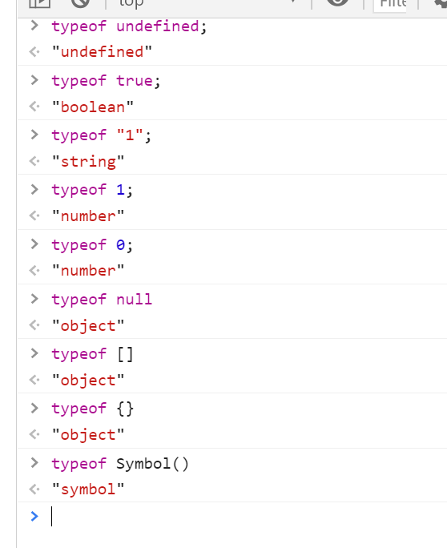
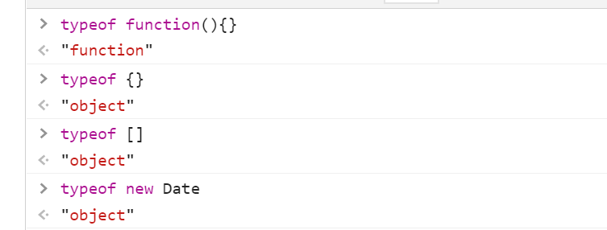
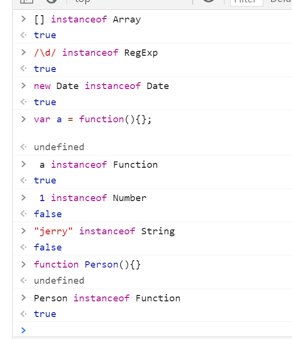
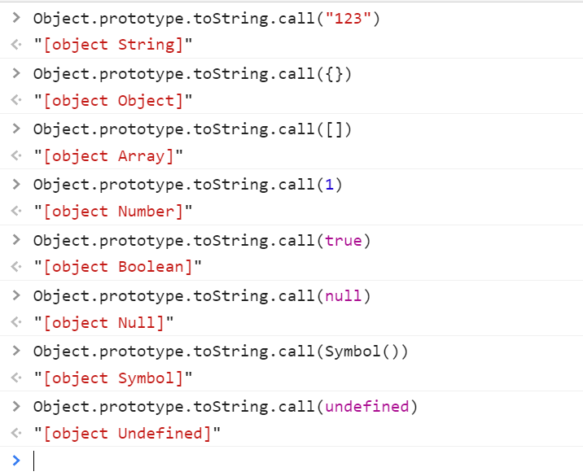
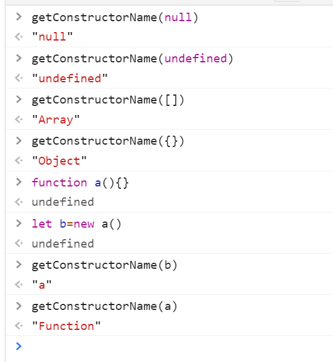
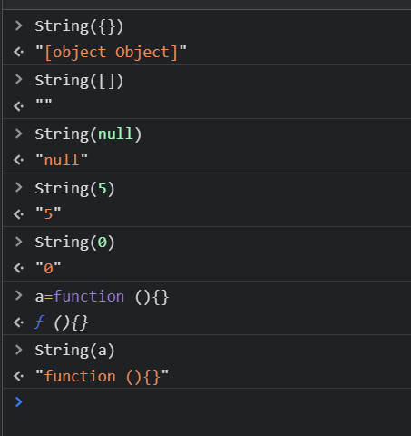
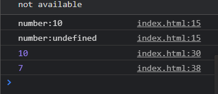
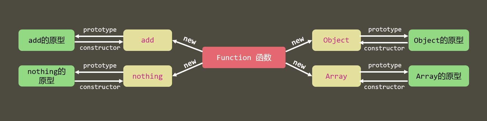
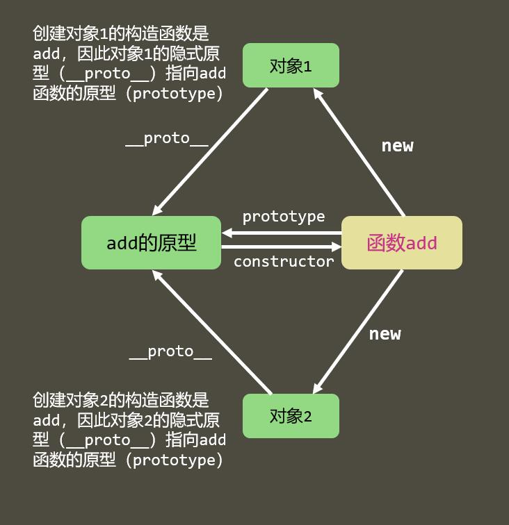
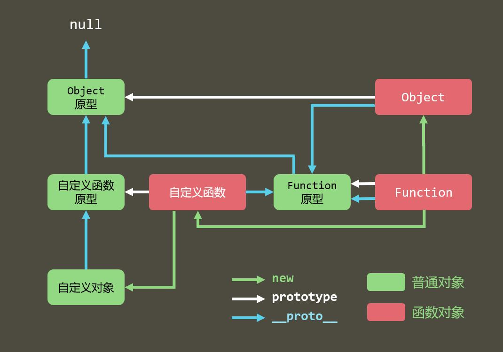

# 类型判断
## typeof

#### 原始类型
* Undefined
* Null ：该类型也只有一个值，即null（小写），null值表示一个空对象指针，所以用typeof操作符检测null值会返回object的原因。
* Boolean
* String
* Number


#### 引用类型
* Object
* Arrary
* Date
* RegExp
* Function



## instanceof
能判断引用类型，不能判断原始类型，内部机制是通过原型链来判断的


## Object.prototype.toString.call
可以识别基本类型以及引用对象类型
不能识别自定义对象类型



## constructor
null或者undefined，没有构造函数

``` javascript
function getConstructorName(obj){
    return (obj===undefined||obj===null)?`${obj}`:        
       (obj.constructor && obj.constructor.toString().match(/function\s*([^(]*)/)[1]);
}
```




# 类型转换
在 JS 中类型转换只有三种情况，分别是：
* 转成布尔值:除了 undefined，null， false， NaN， ''， 0， -0，其他所有值都转为 true，包括所有对象
* 转成字符串
* 转成数字


* 转成字符串



# this
new  》 bind 》调用
多次bind this 指向第一个
```  javascript
       let obj = {
            a: 6
        };
        function foo() {
            console.log(this.a)
            this.print = function () {
                console.log(this.a)
            }
        }
        foo();
        //undefined this指向window
        let obj1 = {
            a: 2,
            foo: foo.bind(obj)
        }
        obj1.foo()
        // 6 this指向obj
        let obj2 = new foo()
        obj2.a = "a"
        obj2.print()
        // "a" this指向obj2
```

``` javascript 
 var number = 10;
    function fn() {
      console.log("number:" + this.number)
    }
    var obj = {
      number: 2,
      show: function () {
        this.number = 3;
        // 只跟函数声明时候的环境有关
        fn();
        // console.log(arguments[0])
        // this 指向 arguments 本身
        arguments[0]()
      },
      show2: function () {
        (function () {
          // 立即执行函数 this指向window 对象
          console.log(this.number);
          this.number = 7
        })()

      }
    }
    obj.show(fn);
    obj.show2();
    console.log(number)

```

# == 和 ===
null==undefined  ture
==类型
* 对于 == 来说，如果对比双方的类型不一样的话，就会进行类型转换
假如我们需要对比 x 和 y 是否相同，就会进行如下判断流程

>1.首先会判断两者类型是否相同。相同的话就是比大小了
>2.类型不相同的话，那么就会进行类型转换
>3.会先判断是否在对比 null 和 undefined，是的话就会返回 true
>4.判断两者类型是否为 string 和 number，是的话就会将字符串转换为 number
>5.判断其中一方是否为 boolean，是的话就会把 boolean 转为 number 再进行判断
>6.判断其中一方是否为 object 且另一方为 string、number 或者 symbol，是的话就会把 object 转为原始类型再进行判断

* ===全等于 类型 值都一样
# 闭包    略
# 深浅拷贝
 * 浅拷贝：只会拷贝所有的属性值到新的对象中，如果属性值是对象的话，拷贝的是地址。
 * 深拷贝：
 ``` javascript
        // 判断拷贝对象类型
        function type(obj) {
            let toString = Object.prototype.toString;
            let map = {
                '[object Boolean]': 'boolean',
                '[object Number]': 'number',
                '[object String]': 'string',
                '[object Function]': 'function',
                '[object Array]': 'array',
                '[object Date]': 'date',
                '[object RegExp]': 'regExp',
                '[object Undefined]': 'undefined',
                '[object Null]': 'null',
                '[object Object]': 'object'
            };
            return map[toString.call(obj)];
        }
        // 深度拷贝
        function deepClone(data) {
            let t = type(data), o, i, ni;

            if (t === 'array') {
                o = [];
            } else if (t === 'object') {
                o = {};
            } else {
                return data;
            }

            if (t === 'array') {
                for (i = 0, ni = data.length; i < ni; i++) {
                    o.push(deepClone(data[i]));
                }
                return o;
            } else if (t === 'object') {
                for (i in data) {
                    o[i] = deepClone(data[i]);
                }
                return o;
            }
        }
```
# 原型链
原型链就是多个对象通过 `__proto__` 的方式连接了起来。

# 原型继承和 Class 继承 
需要配合练习题和视频

# 实现一个简洁版的promise 
手写

# 进程与线程
 * 进程是cpu资源分配的最小单位（是能拥有资源和独立运行的最小单位）
 * 线程是cpu调度的最小单位（线程是建立在进程的基础上的一次程序运行单位，一个进程中可以有多个线程）
>把这些概念拿到浏览器中来说，当你打开一个 Tab 页时，其实就是创建了一个进程，一个进程中可以有多个线程，比如渲染线程、JS 引擎线程、HTTP 请求线程等等。当你发起一个请求时，其实就是创建了一个线程，当请求结束后，该线程可能就会被销毁

浏览器的渲染进程是多线程的
 * GUI 线程
* JS 引擎线程
* 事件触发线程
* 定时器线程
* 网络请求线程


# 为什么 0.1 + 0.2 != 0.3
因为 JS 采用 IEEE 754双精度版本（64位），并且只要采用 IEEE 754的语言都有该问题

# 原型和原型链

- 所有对象都是通过```new 函数```创建
- 所有的函数也是对象
  - 函数中可以有属性
- 所有对象都是引用类型


## 原型 prototype

所有函数都有一个属性：prototype，称之为函数原型

默认情况下，prototype是一个普通的Object对象

默认情况下，prototype中有一个属性，constructor，它也是一个对象，它指向构造函数本身。


## 隐式原型 __proto__

所有的对象都有一个属性：```__proto__```，称之为隐式原型

默认情况下，隐式原型指向创建该对象的函数的原型。

``` javascript
     function test() {
     }
     let obj = new test()
     // obj.__proto__===test.prototype  true
```
``` javascript
function test() {
            if (Math.random() < 0.5) {
                return {}
            } else {
                return []
            }
        }
        let obj = new test()
        //    得到obj的构造函数的名称
        // obj.__proto__.constructor.name
```
当访问一个对象的成员时：

1. 看该对象自身是否拥有该成员，如果有直接使用
2. 在原型链中依次查找是否拥有该成员，如果有直接使用

猴子补丁：在函数原型中加入成员，以增强起对象的功能，猴子补丁会导致原型污染，使用需谨慎。

## 原型链

特殊点：

1. Function的__proto__指向自身的prototype
2. Object的prototype的__proto__指向null


# 原型链的应用

## 基础方法

W3C不推荐直接使用系统成员__proto__

**Object.getPrototypeOf(对象)**

获取对象的隐式原型

**Object.prototype.isPrototypeOf(对象)**

判断当前对象(this)是否在指定对象的原型链上

**对象 instanceof 函数**

判断函数的原型是否在对象的原型链上

**Object.create(对象)**

创建一个新对象，其隐式原型指向指定的对象

**Object.prototype.hasOwnProperty(属性名)**

判断一个对象**自身**是否拥有某个属性

## 应用

**类数组转换为真数组**

```js
Array.prototype.slice.call(类数组);
```

**实现继承**

默认情况下，所有构造函数的父类都是Object

圣杯模式

# 执行上下文

函数执行上下文：一个函数运行之前，创建的一块内存空间，空间中包含有该函数执行所需要的数据，为该函数执行提供支持。

执行上下文栈：call stack，所有执行上下文组成的内存空间。

栈：一种数据结构，先进后出，后进先出。

全局执行上下文：所有JS代码执行之前，都必须有该环境。

JS引擎始终执行的是栈顶的上下文。

## 执行上下文中的内容

1. this指向

1). 直接调用函数，this指向全局对象
2). 在函数外，this指向全局对象
3). 通过对象调用或new一个函数，this指向调用的对象或新对象

2. VO 变量对象

Variable Object：VO 中记录了该环境中所有声明的参数、变量和函数

Global Object: GO，全局执行上下文中的VO

Active Object：AO，当前正在执行的上下文中的VO


1). 确定所有形参值以及特殊变量arguments
2). 确定函数中通过var声明的变量，将它们的值设置为undefined，如果VO中已有该名称，则直接忽略。
3). 确定函数中通过字面量声明的函数，将它们的值设置为指向函数对象，如果VO中已存在该名称，则覆盖。

当一个上下文中的代码执行的时候，如果上下文中不存在某个属性，则会从之前的上下文寻找。
# 作用域链

1. VO中包含一个额外的属性，该属性指向创建该VO的函数本身
2. 每个函数在创建时，会有一个隐藏属性```[[scope]]```，它指向创建该函数时的AO
3. 当访问一个变量时，会先查找自身VO中是否存在，如果不存在，则依次查找```[[scope]]```属性。

某些浏览器会优化作用域链，函数的```[[scope]]```中仅保留需要用到的数据。

# 事件循环

异步：某些函数不会立即执行，需要等到某个时机成熟后才会执行，该函数叫做异步函数。

浏览器的线程：

1. JS执行引擎：负责执行JS代码
2. 渲染线程：负责渲染页面
3. 计时器线程：负责计时
4. 事件监听线程：负责监听事件
5. http网络线程：负责网络通信

事件队列：一块内存空间，用于存放执行时机到达的异步函数。当JS引擎空闲（执行栈没有可执行的上下文），它会从事件队列中拿出第一个函数执行。

事件循环：event loop，是指函数在执行栈、宿主线程、事件队列中的循环移动。
# 五层因特网协议
1.应用层(dns,http) DNS解析成IP并发送http请求

2.传输层(tcp,udp) 建立tcp连接（三次握手）

3.网络层(IP,ARP) IP寻址

4.数据链路层(PPP) 封装成帧

5.物理层(利用物理介质传输比特流) 物理传输（然后传输的时候通过双绞线，电磁波等各种介质）

# OSI七层框架
1.应用层(dns,http) DNS解析成IP并发送http请求
2.表示层：主要处理两个通信系统中交换信息的表示方式，包括数据格式交换，数据加密与解密，数据压缩与终端类型转换等
3.会话层：它具体管理不同用户和进程之间的对话，如控制登陆和注销过程
4.传输层(tcp,udp) 建立tcp连接（三次握手）

5.网络层(IP,ARP) IP寻址

6.数据链路层(PPP) 封装成帧

7.物理层(利用物理介质传输比特流) 物理传输（然后传输的时候通过双绞线，电磁波等各种介质）

**OSI七层框架：**物理层，数据链路层，网络层，传输层，会话层，表示层，应用层。
* 应用层
应用层是OSI参考模型的最高层，是用户与网络的接口。该层通过应用程序来完成网络用户的应用需求，如文件传输、收发电子邮件等。
类比：应用层相当于一个公司的老板。
* 表示层
表示层处理流经结点的数据编码的表示方式问题，以保证一个系统应用层发出的信息可被另一系统的应用层读出。如果必要，该层可提供一种标准表示形式，用于将计算机内部的多种数据表示格式转换成网络通信中采用的标准表示形式。数据压缩和加密也是表示层可提供的转换功能之一。
类比：表示层相当于公司中替老板写文档、演示文稿的助理。
* 会话层
会话层主要功能是管理和协调不同主机上各种进程之间的通信（会话），即负责建立、管理和终止应用程序之间的会话。会话层得名的原因是它很类似于两个实体间的会话概念。例如，一个交互的用户会话以登录到计算机开始，以注销结束。
类比：会话层相当于公司中收寄信、写信封与拆信封的秘书。
* 传输层
传输层的作用是为上层协议提供端到端的可靠的、透明的数据传输服务，包括处理差错控制和流量控制等问题。该层向高层屏蔽了下层数据通信的细节，使高层用户看到的只是在两个传输实体间的一条主机到主机的、可由用户控制和设定的、可靠的数据通路。
传输层传送的协议数据单元称为段（data segment）或报文（Message）。
类比：传输层相当于公司中跑邮局的送信职员。
* 网络层
网络层是为其上层传输层提供服务，传送的协议数据单元称为数据包(Packet)或分组。该层的主要作用是解决如何使数据包通过各结点传送的问题，即通过路径选择算法（路由）将数据包送到目的地。另外，为避免通信子网中出现过多的数据包而造成的网络阻塞，需要对流入的数据包数量进行控制（拥塞控制）。当数据包要跨越多个通信子网才能到达目的地时，还要解决网际互连的问题。
类比：网络层相当于邮局中的信件分拣人员。
作用：
路由选路
拥塞控制、差错检测与恢复
网络互联
* 数据链路层
数据链路层是为其上层网络层提供服务，解决两个相邻结点之间的通信问题，传送的协议数据单元称为数据帧(Data frame)。
数据帧中包含物理地址（又称MAC地址）、控制码、数据及校验码等信息。该层的主要作用是通过校验、确认和反馈重发等手段，将不可靠的物理链路转换成对网络层来说无差错的数据链路。
此外，数据链路层还要协调收发双方的数据传输速率，即进行流量控制，以防止接收方因来不及处理发送方来的高速数据而导致缓冲器溢出及线路阻塞。
类比：数据链路层相当于邮局中的装拆箱人员。
作用：
物理地址定义 网络拓扑机构
链路参数 差错验证
物理介质访问 流控制
* 物理层
物理层是OSI参考模型的最底层，它利用传输介质为其上层数据链路层提供物理连接。它主要关心的是通过物理链路从一个节点向另一个节点传送比特流（bit），物理链路可能是铜缆、光纤、无线或其他的通讯媒介。它关心的问题有：多少伏电压代表1？多少伏电压代表0？时钟速率是多少？采用全双工、半双工还是单工通信？
总的来说物理层关心的是链
路的机械、电气、功能和规程特性。
类比：物理层相当于邮局中的搬运工人。
作用：
提供传输数据的物理通路，传输数据

# 三次握手
客户端发送一个标识SYN的数据包给服务器，服务器接收到数据包之后，回一个SYN ACK 标志的数据包给客户端，客户端收到数据报之后，在回一个标识ACK的数据报，然后连接建立。

# 四次挥手
主动断开方发送一个数据报给


