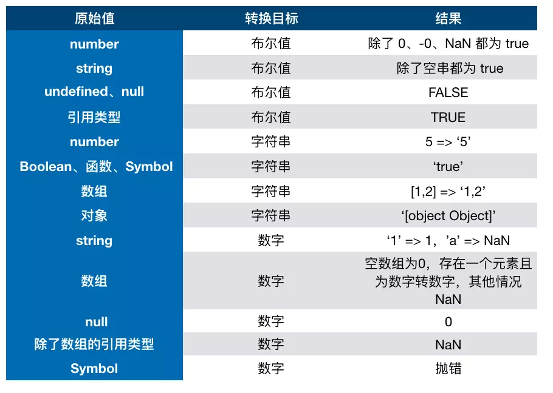

# 类型判断
## typeof

#### 原始类型
* Undefined
* Null ：该类型也只有一个值，即null（小写），null值表示一个空对象指针，所以用typeof操作符检测null值会返回object的原因。
* Boolean
* String
* Number


#### 引用类型
* Object
* Arrary
* Date
* RegExp
* Function


## instanceof
能判断引用类型，不能判断原始类型，内部机制是通过原型链来判断的


## Object.prototype.toString.call
可以识别基本类型以及引用对象类型
不能识别自定义对象类型


## constructor
null或者undefined，没有构造函数

``` javascript
function getConstructorName(obj){
    return (obj===undefined||obj===null)?`${obj}`:        
       (obj.constructor && obj.constructor.toString().match(/function\s*([^(]*)/)[1]);
}
```


# 类型转换
在 JS 中类型转换只有三种情况，分别是：
* 转成布尔值:除了 undefined，null， false， NaN， ''， 0， -0，其他所有值都转为 true，包括所有对象
* 转成字符串
* 转成数字



* 转成字符串


# this
new  》 bind 》调用
多次bind this 指向第一个
```  javascript
       let obj = {
            a: 6
        };
        function foo() {
            console.log(this.a)
            this.print = function () {
                console.log(this.a)
            }
        }
        foo();
        //undefined this指向window
        let obj1 = {
            a: 2,
            foo: foo.bind(obj)
        }
        obj1.foo()
        // 6 this指向obj
        let obj2 = new foo()
        obj2.a = "a"
        obj2.print()
        // "a" this指向obj2
```
# == 和 ===
null==undefined  ture
==类型
* 对于 == 来说，如果对比双方的类型不一样的话，就会进行类型转换
假如我们需要对比 x 和 y 是否相同，就会进行如下判断流程

>1.首先会判断两者类型是否相同。相同的话就是比大小了
>2.类型不相同的话，那么就会进行类型转换
>3.会先判断是否在对比 null 和 undefined，是的话就会返回 true
>4.判断两者类型是否为 string 和 number，是的话就会将字符串转换为 number
>5.判断其中一方是否为 boolean，是的话就会把 boolean 转为 number 再进行判断
>6.判断其中一方是否为 object 且另一方为 string、number 或者 symbol，是的话就会把 object 转为原始类型再进行判断

* ===全等于 类型 值都一样
# 闭包    略
# 深浅拷贝
 * 浅拷贝：只会拷贝所有的属性值到新的对象中，如果属性值是对象的话，拷贝的是地址。
 * 深拷贝：
 ``` javascript
        // 判断拷贝对象类型
        function type(obj) {
            let toString = Object.prototype.toString;
            let map = {
                '[object Boolean]': 'boolean',
                '[object Number]': 'number',
                '[object String]': 'string',
                '[object Function]': 'function',
                '[object Array]': 'array',
                '[object Date]': 'date',
                '[object RegExp]': 'regExp',
                '[object Undefined]': 'undefined',
                '[object Null]': 'null',
                '[object Object]': 'object'
            };
            return map[toString.call(obj)];
        }
        // 深度拷贝
        function deepClone(data) {
            let t = type(data), o, i, ni;

            if (t === 'array') {
                o = [];
            } else if (t === 'object') {
                o = {};
            } else {
                return data;
            }

            if (t === 'array') {
                for (i = 0, ni = data.length; i < ni; i++) {
                    o.push(deepClone(data[i]));
                }
                return o;
            } else if (t === 'object') {
                for (i in data) {
                    o[i] = deepClone(data[i]);
                }
                return o;
            }
        }
```
# 原型链
原型链就是多个对象通过 `__proto__` 的方式连接了起来。

# 原型继承和 Class 继承 
需要配合练习题和视频

# 实现一个简洁版的promise 
手写

# 进程与线程
 * 进程是cpu资源分配的最小单位（是能拥有资源和独立运行的最小单位）
 * 线程是cpu调度的最小单位（线程是建立在进程的基础上的一次程序运行单位，一个进程中可以有多个线程）
>把这些概念拿到浏览器中来说，当你打开一个 Tab 页时，其实就是创建了一个进程，一个进程中可以有多个线程，比如渲染线程、JS 引擎线程、HTTP 请求线程等等。当你发起一个请求时，其实就是创建了一个线程，当请求结束后，该线程可能就会被销毁

浏览器的渲染进程是多线程的
 * GUI 线程
* JS 引擎线程
* 事件触发线程
* 定时器线程
* 网络请求线程


# 为什么 0.1 + 0.2 != 0.3
因为 JS 采用 IEEE 754双精度版本（64位），并且只要采用 IEEE 754的语言都有该问题

# 原型和原型链

- 所有对象都是通过```new 函数```创建
- 所有的函数也是对象
  - 函数中可以有属性
- 所有对象都是引用类型


## 原型 prototype

所有函数都有一个属性：prototype，称之为函数原型

默认情况下，prototype是一个普通的Object对象

默认情况下，prototype中有一个属性，constructor，它也是一个对象，它指向构造函数本身。


## 隐式原型 __proto__

所有的对象都有一个属性：```__proto__```，称之为隐式原型

默认情况下，隐式原型指向创建该对象的函数的原型。

``` javascript
     function test() {
     }
     let obj = new test()
     // obj.__proto__===test.prototype  true
```
``` javascript
function test() {
            if (Math.random() < 0.5) {
                return {}
            } else {
                return []
            }
        }
        let obj = new test()
        //    得到obj的构造函数的名称
        // obj.__proto__.constructor.name
```
当访问一个对象的成员时：

1. 看该对象自身是否拥有该成员，如果有直接使用
2. 在原型链中依次查找是否拥有该成员，如果有直接使用

猴子补丁：在函数原型中加入成员，以增强起对象的功能，猴子补丁会导致原型污染，使用需谨慎。

## 原型链

特殊点：

1. Function的__proto__指向自身的prototype
2. Object的prototype的__proto__指向null


# 原型链的应用

## 基础方法

W3C不推荐直接使用系统成员__proto__

**Object.getPrototypeOf(对象)**

获取对象的隐式原型

**Object.prototype.isPrototypeOf(对象)**

判断当前对象(this)是否在指定对象的原型链上

**对象 instanceof 函数**

判断函数的原型是否在对象的原型链上

**Object.create(对象)**

创建一个新对象，其隐式原型指向指定的对象

**Object.prototype.hasOwnProperty(属性名)**

判断一个对象**自身**是否拥有某个属性

## 应用

**类数组转换为真数组**

```js
Array.prototype.slice.call(类数组);
```

**实现继承**

默认情况下，所有构造函数的父类都是Object

圣杯模式

# 执行上下文

函数执行上下文：一个函数运行之前，创建的一块内存空间，空间中包含有该函数执行所需要的数据，为该函数执行提供支持。

执行上下文栈：call stack，所有执行上下文组成的内存空间。

栈：一种数据结构，先进后出，后进先出。

全局执行上下文：所有JS代码执行之前，都必须有该环境。

JS引擎始终执行的是栈顶的上下文。

## 执行上下文中的内容

1. this指向

1). 直接调用函数，this指向全局对象
2). 在函数外，this指向全局对象
3). 通过对象调用或new一个函数，this指向调用的对象或新对象

2. VO 变量对象

Variable Object：VO 中记录了该环境中所有声明的参数、变量和函数

Global Object: GO，全局执行上下文中的VO

Active Object：AO，当前正在执行的上下文中的VO


1). 确定所有形参值以及特殊变量arguments
2). 确定函数中通过var声明的变量，将它们的值设置为undefined，如果VO中已有该名称，则直接忽略。
3). 确定函数中通过字面量声明的函数，将它们的值设置为指向函数对象，如果VO中已存在该名称，则覆盖。

当一个上下文中的代码执行的时候，如果上下文中不存在某个属性，则会从之前的上下文寻找。
# 作用域链

1. VO中包含一个额外的属性，该属性指向创建该VO的函数本身
2. 每个函数在创建时，会有一个隐藏属性```[[scope]]```，它指向创建该函数时的AO
3. 当访问一个变量时，会先查找自身VO中是否存在，如果不存在，则依次查找```[[scope]]```属性。

某些浏览器会优化作用域链，函数的```[[scope]]```中仅保留需要用到的数据。

# 事件循环

异步：某些函数不会立即执行，需要等到某个时机成熟后才会执行，该函数叫做异步函数。

浏览器的线程：

1. JS执行引擎：负责执行JS代码
2. 渲染线程：负责渲染页面
3. 计时器线程：负责计时
4. 事件监听线程：负责监听事件
5. http网络线程：负责网络通信

事件队列：一块内存空间，用于存放执行时机到达的异步函数。当JS引擎空闲（执行栈没有可执行的上下文），它会从事件队列中拿出第一个函数执行。

事件循环：event loop，是指函数在执行栈、宿主线程、事件队列中的循环移动。