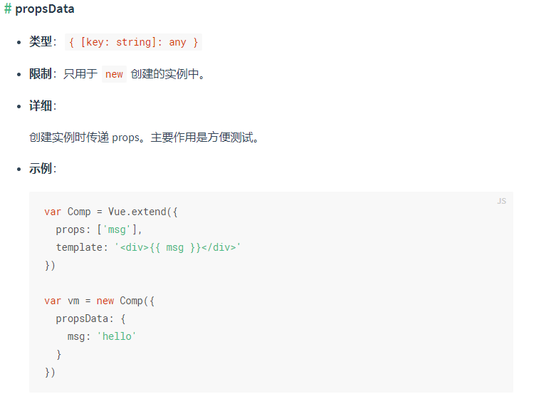
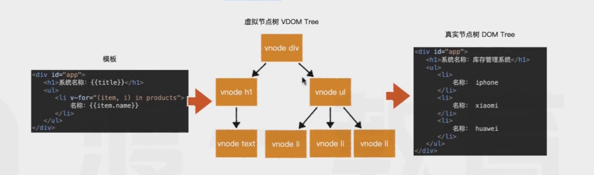
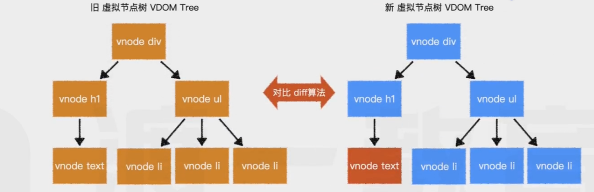
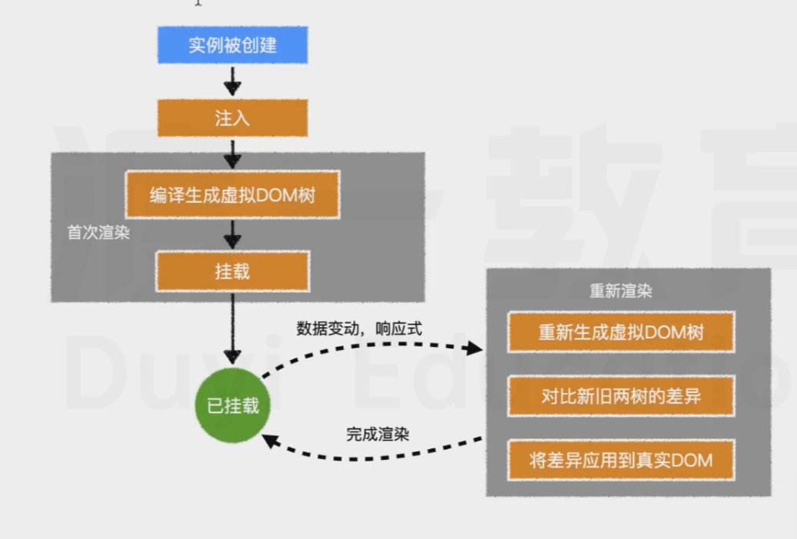

# vue
## 注入
配置对象中的部分内容内提取到vue实例中：
默认的有
* data
* methods
* computed
* props
* watch
* propsDate(https://cn.vuejs.org/v2/api/#propsData)

该过程称之为注入
**注入的目的有两个：**
* 完成数据响应式  
vue是怎么知道数据被更改了？  
vue2.0是通过`  Object.defineProperty`方法完成了数据响应式，vue3.0是用过`  class proxy{}`完成了数据响应式。
** Object.defineProperty 有局限性 不能感知新添加和删除的属性 等等
** class proxy{} 代理  效率更高
* 绑定 this
## 虚拟dom渲染
为了提高渲染效率，vue会把模版编译称为虚拟DOM树，然后再生成真是的DOM

当数据更改时，讲重新编译成虚拟DOM树，然后对前后两棵树进行对比，仅将差异部分反映到真实DOM,这样既可最小程度的改动真实DOM,提高页面效率

因此，对于vue而言，提升效率重点着眼于两个方面：
* 减少新的虚拟DOM的生成
* 保证对比之后，只有必要节点有变化  

`vue` 提供了多种方式生成虚拟DOM：
1.在挂载的元素内部直接书写，此时将使用元素的outerHTML作为模板
2.在template 配置中书写
3.在render配置中用函数直接创建虚拟节点树，此时完全脱离模版，将省编译步骤
这些步骤从上到下，** 优先级逐渐提升 **
`注意：虚拟节点树必须是单根的`

## 挂载
将生成的真实DOM树，放置到某个元素位置，称之为挂载
挂载方式
1.通过el:"css选择器"进行配置
2.通过vue实例方法 vm.$mount("css选择器")进行配置

## 完整流程
