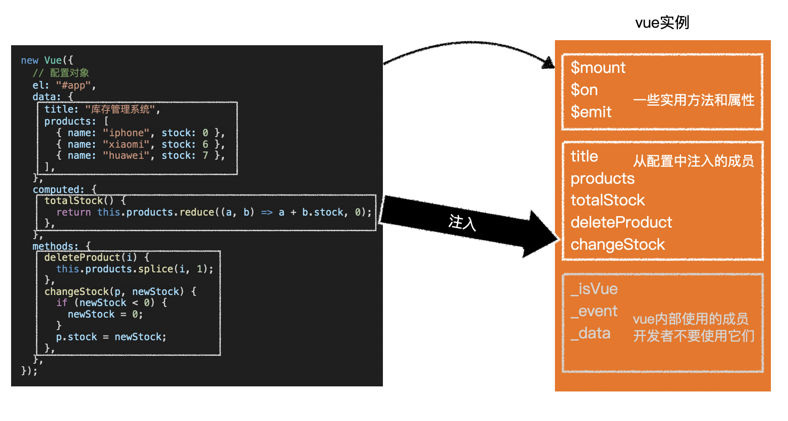
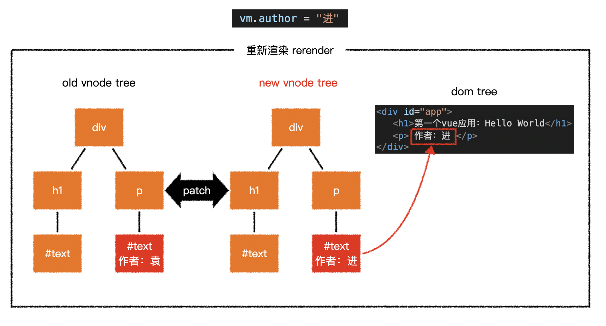
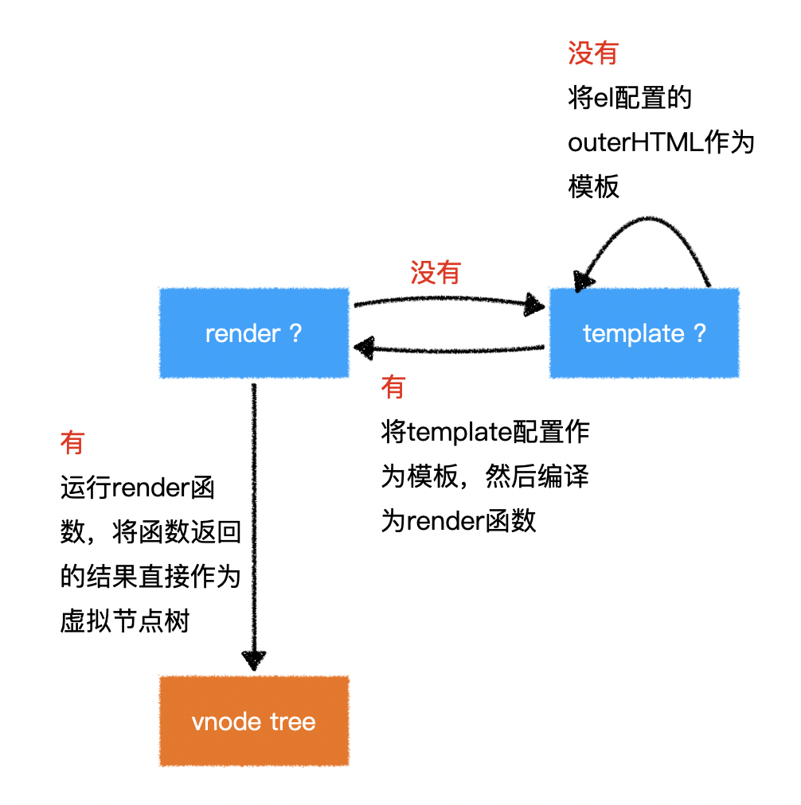

# 框架的由来
## 服务端渲染
> sequenceDiagram 流程图
浏览器->>服务器: 请求网址
Note right of 服务器: 组装页面(服务端渲染)
服务器->>浏览器: 完整页面
浏览器请求页面地址，服务器组装完页面，把html页面发送给浏览器，浏览器再渲染页面

## 前后端分离

>equenceDiagram
浏览器->>服务器: 请求网址
服务器->>浏览器: 无内容的html
activate 浏览器
浏览器-->>服务器: ajax
服务器-->>浏览器: 各种业务数据
Note left of 浏览器: 运行js，创建元素，渲染页面
deactivate 浏览器
## 单页应用
>sequenceDiagram
浏览器->>服务器: 请求网址
服务器->>浏览器: 无内容的html
activate 浏览器
Note left of 浏览器: 运行js，创建元素，渲染页面
浏览器-->>服务器: ajax
服务器-->>浏览器: 各种业务数据
Note left of 浏览器: 跳转页面
浏览器-->>服务器: ajax
服务器-->>浏览器: 各种业务数据
Note left of 浏览器: JS重新构建页面元素
deactivate 浏览器
## vue框架
>sequenceDiagram
浏览器->>服务器: 请求网址
服务器->>浏览器: 无内容的html
activate 浏览器
Note left of 浏览器: 运行包含vue的js，使用框架渲染页面
浏览器-->>服务器: ajax
服务器-->>浏览器: 各种业务数据
Note left of 浏览器: 使用vue-router跳转页面
deactivate 浏览器

# 注入


vue会将以下配置注入到vue实例：

* data：和界面相关的数据
* computed：通过已有数据计算得来的数据，将来详细讲解
* methods：方法

# 虚拟DOM树
直接操作真实的DOM会引发严重的效率问题，vue使用虚拟DOM（vnode）的方式来描述要渲染的内容

vnode是一个普通的JS对象，用于描述界面上应该有什么，比如：
``` javascript
var vnode = {
  tag: "h1",
  children: [
    { tag: undefined, text: "第一个vue应用：Hello World"}
  ]
}
```

上面的对象描述了：
``` javascript
有一个标签名为h1的节点，它有一个子节点，该子节点是一个文本，内容为「第一个vue应用：Hello World」
```
vue模板并不是真实的DOM，它会被编译为虚拟DOM
``` html
<div id="app">
  <h1>第一个vue应用：{{title}}</h1>
  <p>作者：{{author}}</p>
</div>
```

上面的模板会被编译为类似下面结构的虚拟DOM

``` javascript
{
  tag: "div",
  children: [
    { tag: "h1", children: [ { text: "第一个vue应用：Hello World" } ] },
    { tag: "p", children: [ { text: "作者：袁" } ] }
  ]
}
```

虚拟DOM树会最终生成为真实的DOM树

当数据变化后，将引发重新渲染，vue会比较新旧两棵vnode tree，找出差异，然后仅把差异部分应用到真实dom tree中

可见，在vue中，要得到最终的界面，必须要生成一个vnode tree
vue通过以下逻辑生成vnode tree：

`注意：虚拟节点树必须是单根的`

# 挂载
将生成的真实DOM树，放置到某个元素位置，称之为挂载

挂载的方式：

1.通过el:"css选择器"进行配置
2.通过vue实例.$mount("css选择器")进行配置
## 完整流程
